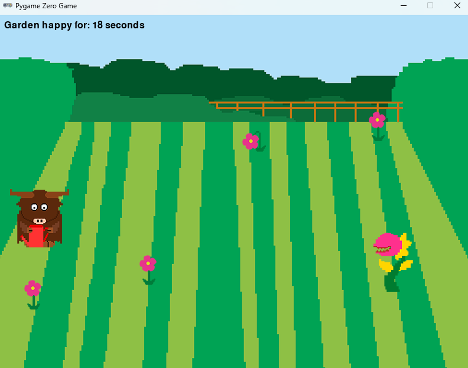

# Gardening Cow

## Game Overview

In **Gardening Cow**, the player controls a cow that must move around the garden to water wilting flowers. Flowers randomly wilt after a few seconds, and the player must reach the wilting flower and press the space bar to water it. 
However, one flower will mutate into a dangerous Fangflower that will chase the cow around. If the cow is hit or any flowers die, the game ends.

## How to Play

* The goal of the game is to keep the garden happy by watering wilting flowers.
* Flowers wilt randomly over time. If a flower wilts for more than 10 seconds, the game is over.
* Mutating flowers can turn into Fangflowers that will chase and collide with the cow. Avoid them!
* Press the space bar to water a wilting flower.

## Installation Instructions

1. Clone this repository to your local machine:

   ```bash
   git clone https://github.com/Johnmcginnes168/Gardening-Cow-Game.git
   cd gardening cow
   ```

2. Install the required dependencies. You'll need `pgzrun` for this game. You can install it using pip:

   ```bash
   pip install pgzero
   ```

3. Run the game:

   ```bash
   python cow.py
   ```

## Gameplay Controls

* **Arrow Keys**: Move the cow around the garden.
* **Space Bar**: Water the wilting flowers.

## Screenshot



## Credits

* **Game Developer**: John McGinnes
